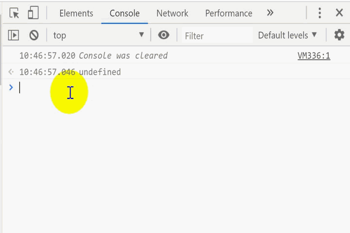

<h1 align="center">Coding life</h1>

  
<h2 align="center">
Record Something important with pictures!</h2>
</p>

 
# Catalogue

- [js-important](#js-important)
    - [object.keys](#object.keys)
    - [debounce & throttle](#debounce&nbsp;&&nbsp;throttle)
    - [random_number_array](#random&nbsp;number&nbsp;array)
    - [map "v:1" to "version:1.0.0"](#map&nbsp;&quotv:1&quot&nbsp;to&nbsp;&quotversion:1.0.0&quot)

- [nodejs](#nodejs)
- [serverless](#serverless)
- [java-important](#java-important)


# js-important
## object.keys
<p align="center">

</p>

## debounce & throttle


```javascript
function debounce(fn){
    var timer;
    return function(){
        if(timer) 
        clearTimeout(timer);
        timer=setTimeout(()=>fn.call(this,arguments),1000);
    }
}
```
<p align="center">

</p>

```javascript
function throttle(fn){
    let timer;
    return function(){
        if(timer) 
        return;
        timer=setTimeout(()=>{fn.call(this,arguments);console.log(arguments);timer=null;},1000);
    }
}
```
<p align="center">
    
</p>


## random number array
<p align="center">

</p>

## map "v:1" to "version:1.0.0"

```javascript
var objectMap=o=>keyMap=>valueMap=>{
	var newObject={};
    Object.keys(o).forEach(key => {
        newObject[keyMap[key]] =valueMap[o[key]];
    });    
    return newObject
}
let o ={v:'1'} ;
objectMap(o)({v:'version'})({'1':'1.0.0'});
```

# nodejs
# serverless
# java-important
