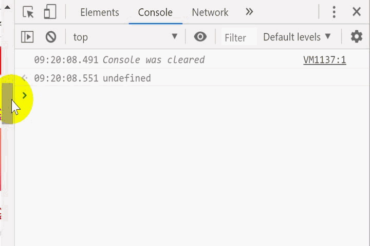

<h1 align="center">Coding life</h1>


<h2 align="center">
Record Something important with pictures!</h2>
</p>


## Catalogue

- [js-important](#js-important)
    - [object.keys](#object.keys)
    - [debounce & throttle](#debounce\ &\ throttle)
- [java-important](#java-important)


# js-important
## object.keys
<p align="center">

</p>

## debounce & throttle


```javascript
function debounce(fn){
    var timer;
    return function(){
        if(timer) 
        clearTimeout(timer);
        timer=setTimeout(()=>fn.call(this,arguments),1000);
    }
}
```
<p align="center">

</p>

```javascript
function throttle(fn){
    let timer;
    return function(){
        if(timer) 
        return;
        timer=setTimeout(()=>{fn.call(this,arguments);console.log(arguments);timer=null;},1000);
    }
}
```
<p align="center">

</p>

# java-important
